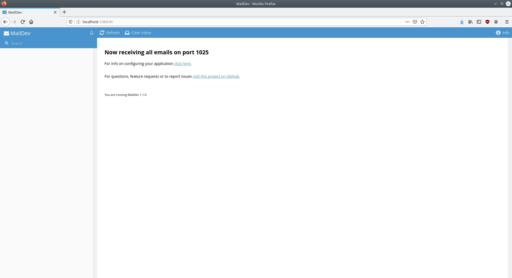

# springit-kotlin
Springit project from "Getting Started with Spring Boot 2" on Udemy ported to Kotlin

## Setting up an email server

For sending activation emails to new users, it is necessary to set up a local email server. [MailDev](https://github.com/maildev/maildev) is a simple email server that runs on top of Node.js.

Install MailDev:

```bash
# npm install -g maildev
```

Run MailDev

```bash
$ maildev
```

Maildev should print its endpoints:

```bash
MailDev webapp running at http://0.0.0.0:1080
MailDev SMTP Server running at 0.0.0.0:1025
```

When opening localhost:1080 in a browser, the following user interface should be displayed:



